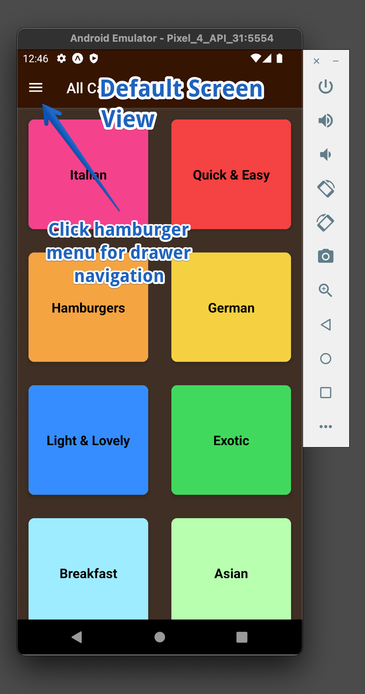
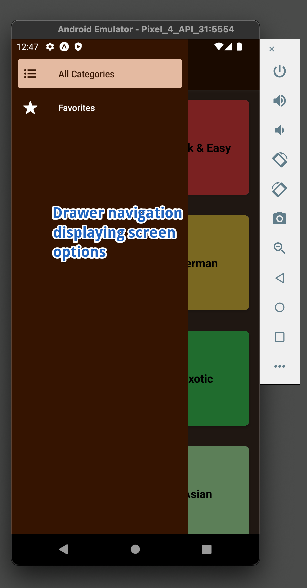
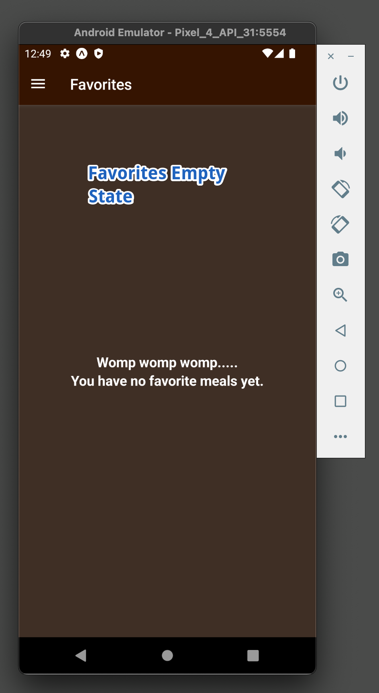
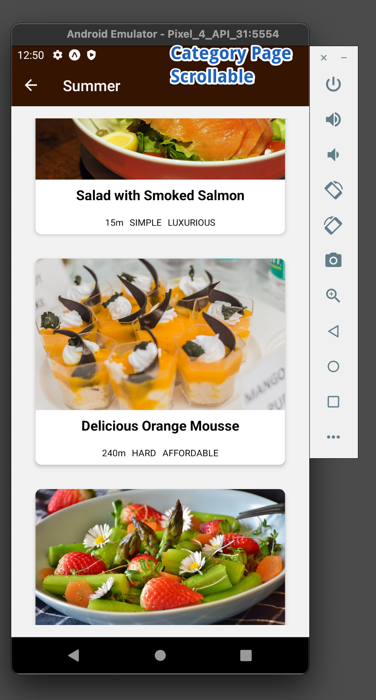
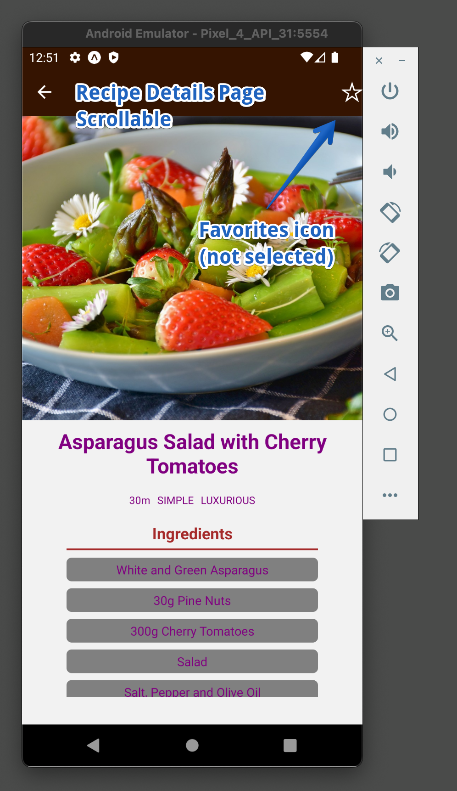
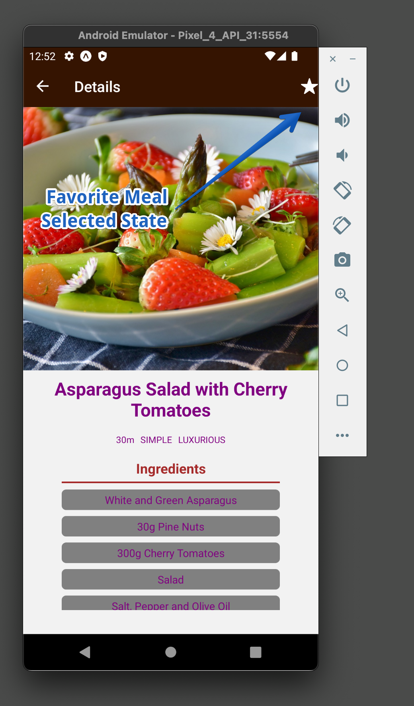
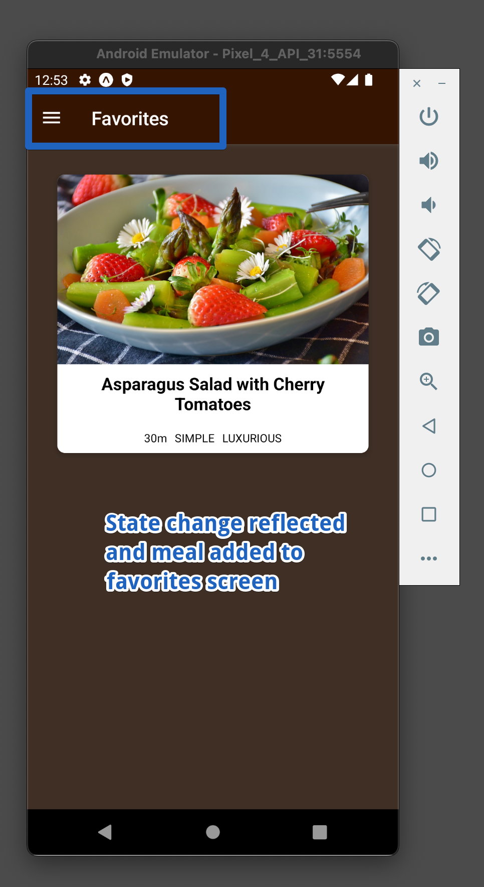

# Meal App
React Native app using navigation, redux and context api

[React Native Practical Guide](https://www.udemy.com/course/react-native-the-practical-guide/)

## Demo

## To run locally:
- clone repo

- `npm install`

- `npm start `

- `a` to start Android emulator

- `i` to start iOS simulator

### Screenshots

## Bugs
- Unable to run iOS simulator after installing drawer navigation dependencies